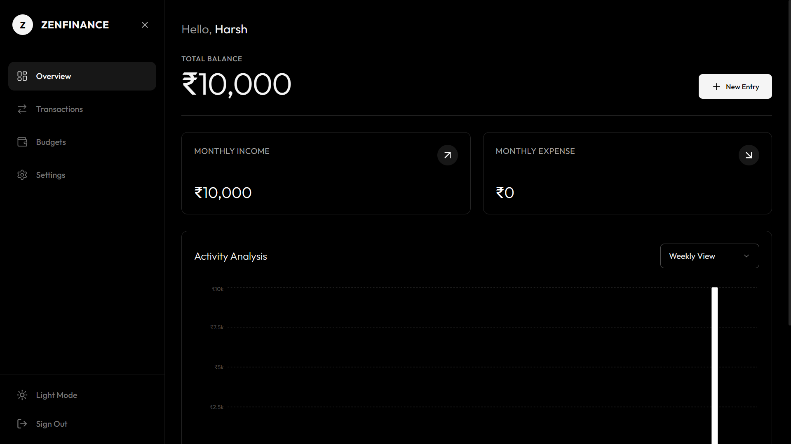

# 🧘 Zen-Finance

[](https://vitejs.dev/)
[](https://reactjs.org/)
[](https://www.typescriptlang.org/)
[](https://tailwindcss.com/)
[](https://firebase.google.com/)
[](https://www.framer.com/motion/)

---



## 📋 Table of Contents
- [Introduction](#-introduction)
- [Key Features](#-key-features)
- [Tech Stack](#-tech-stack)
- [Project Structure](#-project-structure)
- [Getting Started](#-getting-started)
- [Configuration](#-configuration)
- [Screenshots](#-screenshots)

---

## 🚀 Introduction
**Zen-Finance** is a premium, modern financial management application designed to bring peace of mind to your personal finances. With a clean, minimalist interface and powerful tracking capabilities, it helps you manage transactions, set budgets, and visualize your financial health with ease.

Built with a focus on performance and user experience, Zen-Finance leverages the latest web technologies to provide a seamless, real-time experience.

---

## ✨ Key Features

- **🔐 Secure Authentication**: Robust login and registration system powered by Firebase Auth.
- **📊 Interactive Dashboard**: Visualized financial insights using Recharts for patterns and trends.
- **💸 Transaction Management**: Effortlessly log, categorize, and track your expenses and income.
- **📅 Budget Planning**: Set monthly limits and monitor your spending habits in real-time.
- **📄 Professional Reports**: Export your financial data to PDF format for offline review or sharing.
- **🎨 Premium UI/UX**: A beautiful, responsive design crafted with Tailwind CSS and smooth animations via Framer Motion.
- **⚡ Real-time Sync**: Instant data synchronization across devices thanks to Firestore.

---

## 🛠 Tech Stack

### Frontend
- **Framework**: [React 18](https://reactjs.org/) with [Vite](https://vitejs.dev/)
- **Language**: [TypeScript](https://www.typescriptlang.org/)
- **Styling**: [Tailwind CSS](https://tailwindcss.com/) & [Framer Motion](https://www.framer.com/motion/)
- **Icons**: [Lucide React](https://lucide.dev/)
- **Charts**: [Recharts](https://recharts.org/)

### Backend & State
- **Database**: [Google Firebase (Firestore)](https://firebase.google.com/)
- **Auth**: [Firebase Authentication](https://firebase.google.com/products/auth)
- **State management**: [Zustand](https://github.com/pmndrs/zustand)

---

## 📂 Project Structure

```bash
Zen-Finance/
├── public/                 # Static assets (logos, thumbnails)
├── src/
│   ├── components/         # Reusable UI components
│   │   ├── ui/             # Atomic design elements
│   │   └── ...             # Feature-specific components
│   ├── context/            # React Context providers (Auth)
│   ├── pages/              # Main application views (Dashboard, etc.)
│   ├── services/           # External API/Service integrations
│   ├── store.ts            # Global state management with Zustand
│   ├── firebase.ts         # Firebase initialization & config
│   ├── types.ts            # TypeScript interfaces & types
│   ├── utils/              # Helper functions & constants
│   ├── App.tsx             # Root component & Routing
│   └── main.tsx            # Entry point
├── .env                    # Environment variables
├── tailwind.config.js      # Tailwind CSS configuration
└── vite.config.ts          # Vite configuration
```

---

## 🏁 Getting Started

Follow these steps to set up the project locally:

### 1. Clone the repository
```bash
git clone https://github.com/yourusername/zen-finance.git
cd zen-finance
```

### 2. Install dependencies
```bash
npm install
```

### 3. Set up Environment Variables
Create a `.env` file in the root directory and add your Firebase configuration:
```env
VITE_FIREBASE_API_KEY=your_api_key
VITE_FIREBASE_AUTH_DOMAIN=your_auth_domain
VITE_FIREBASE_PROJECT_ID=your_project_id
VITE_FIREBASE_STORAGE_BUCKET=your_storage_bucket
VITE_FIREBASE_MESSAGING_SENDER_ID=your_sender_id
VITE_FIREBASE_APP_ID=your_app_id
VITE_FIREBASE_MEASUREMENT_ID=your_measurement_id
```

### 4. Run the development server
```bash
npm run dev
```

The application will be available at `http://localhost:5173`.

---

## ⚙️ Configuration

To fully utilize the features of Zen-Finance, ensure you have a Firebase project set up with:
1. **Firestore Database** (Test mode or appropriate rules).
2. **Authentication** (Email/Password enabled).

---

## 🤝 Contributing

Contributions are welcome! Feel free to open an issue or submit a pull request.

1. Fork the project
2. Create your Feature Branch (`git checkout -b feature/AmazingFeature`)
3. Commit your changes (`git commit -m 'Add some AmazingFeature'`)
4. Push to the Branch (`git push origin feature/AmazingFeature`)
5. Open a Pull Request

---

## 📄 License

Distributed under the MIT License. See `LICENSE` for more information.

---

<p align="center">Made with ❤️ for financial clarity</p>
